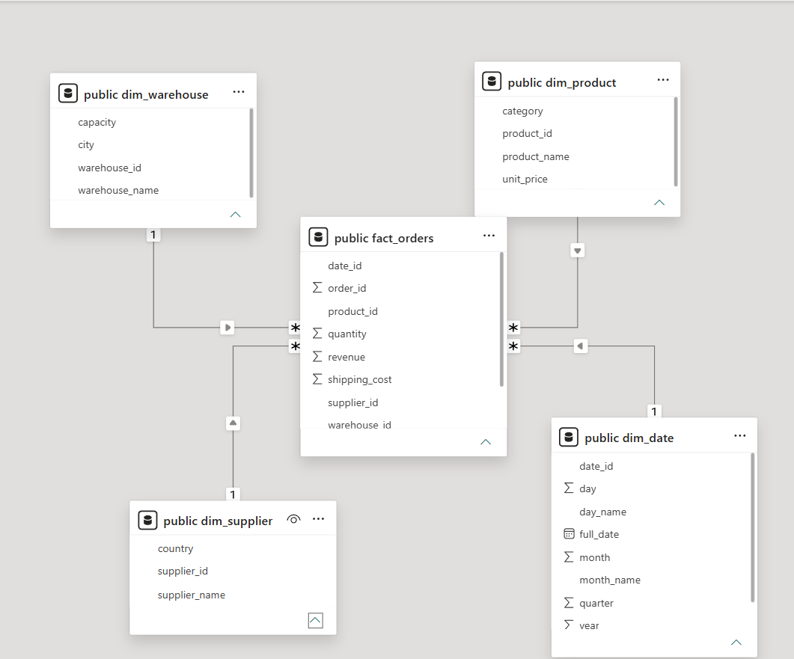
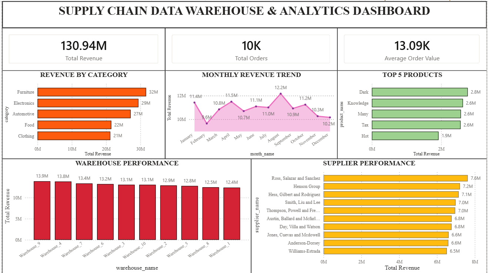

# Supply Chain Data Warehouse & Analytics Platform

## Project Overview

This project demonstrates the design and implementation of a modern Supply Chain Data Warehouse using PostgreSQL, Python ETL pipelines, SQL analytics, and Power BI dashboards.

The system simulates supply chain operations by generating synthetic data for products, suppliers, warehouses, and orders. The data is transformed and loaded into a dimensional warehouse modeled using a Star Schema, enabling efficient business analytics and reporting.

---

## Objectives

* Design a scalable dimensional data warehouse.
* Implement ETL pipelines using Python.
* Load and manage data in PostgreSQL.
* Perform analytical SQL queries for business insights.
* Build an interactive Power BI dashboard for decision-making.

---

## Tech Stack

| Component             | Technology           |
| --------------------- | -------------------- |
| Database              | PostgreSQL           |
| ETL                   | Python               |
| Data Generation       | Faker, Pandas        |
| Database Connectivity | SQLAlchemy, psycopg2 |
| Analytics             | SQL                  |
| Visualization         | Power BI             |
| Version Control       | Git & GitHub         |

---

## Data Warehouse Architecture

The project follows a Star Schema design.

### Dimension Tables

* Dim_Product
* Dim_Supplier
* Dim_Warehouse
* Dim_Date

### Fact Table

* Fact_Orders

### Schema Diagram



---

## Project Structure

```text
Supply-Chain-Data-Warehouse/
│
├── dashboards/
│   └── Power_BI_dashboard.png
│
├── docs/
│   ├── business_insights.md
│   └── STAR_schema.png
│
├── data/
│   ├── raw/
│   └── processed/
│
├── etl/
│   ├── config.py
│   ├── generate_data.py
│   ├── generate_fact_orders.py
│   ├── load_data.py
│   └── main.py
│
├── sql/
│   ├── create_tables.sql
│   └── analytics_queries.sql
│
├── tests/
├── .env.example
├── .gitignore
├── requirements.txt
└── README.md
```

---

## ETL Pipeline

### Extract

Synthetic supply chain data is generated using the Faker library.

### Transform

Data is validated and structured using Pandas.

### Load

Data is loaded into PostgreSQL dimension and fact tables using SQLAlchemy.

Pipeline Flow:

```text
Faker
   ↓
Pandas DataFrames
   ↓
Python ETL
   ↓
PostgreSQL Data Warehouse
   ↓
SQL Analytics
   ↓
Power BI Dashboard
```

---

## Dataset Summary

| Table         | Records |
| ------------- | ------: |
| Dim_Product   |     100 |
| Dim_Supplier  |      20 |
| Dim_Warehouse |      10 |
| Dim_Date      |     365 |
| Fact_Orders   |  10,000 |

---

## Analytical SQL Queries

The project includes business-oriented analytical queries such as:

* Revenue by Product Category
* Monthly Revenue Trends
* Top Revenue Generating Products
* Supplier Performance Analysis
* Warehouse Performance Analysis
* Category Revenue Contribution
* Top Product in Each Category

Advanced SQL concepts used:

* Joins
* Aggregations
* Window Functions
* Ranking Functions
* Common Table Expressions (CTEs)

---

## Power BI Dashboard

The Power BI dashboard provides:

### Key Performance Indicators

* Total Revenue
* Total Orders
* Average Order Value

### Business Insights

* Revenue by Category
* Monthly Revenue Trend
* Top Products
* Supplier Performance
* Warehouse Performance

### Dashboard Preview



---

## Key Insights

* Total Revenue generated: **130.94M**
* Total Orders processed: **10,000**
* Furniture was the highest revenue-generating category.
* August recorded the highest monthly revenue.
* Ross, Salazar and Sanchez was the top-performing supplier.
* Warehouse_4 generated the highest warehouse revenue.

---

## Future Enhancements

* Integration with real-world supply chain datasets.
* Automated ETL scheduling using Apache Airflow.
* Cloud deployment using AWS or Azure.
* Real-time data ingestion pipelines.
* Advanced forecasting and predictive analytics.

---

## Author

**Riya Gupta**

B.Tech Computer Science (IoT & Intelligent Systems)
Manipal University Jaipur

GitHub: https://github.com/StaRi-ya-se
